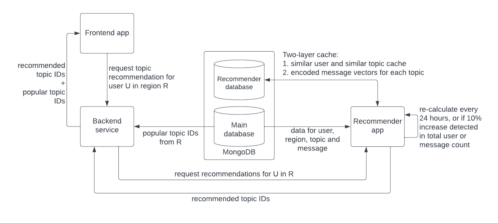

# Recommendation System
## Usage
The recommendation system serves to generate topic recommendations for users based on two-level of filtering:
1. User-based similarity filter (collaborative filtering), and
2. Topic-based similarity filter (content-based filtering)

Upon request for topic recommendations, the backend server will access the recommender API to get custom recommendation for the user, and then combine the recommended topics with popular topics to respond to the user request.

## Architecture

Find [recommender-db-structure.md](../resources/recommender-db-structure.md) to see the database structure.

### Scheduler
The job/task and scheduler definition of the recommendation system is found in **recommender/worker.py**. The current scheduler configuration is as follows:

- Every **4 hours**, check for total message increase in the Main database. If the increase is greater than **10%**, then re-calculate the topic similarities and update the `tb_rec_cache`.
- Every **4 hours**, check for total user increase in the Main database. If the increase is greater than **10%**, then re-calculate the user similarities and update the `ub_rec_cache`.
- Every **24 hours**, re-sample and encode messages from all topics and update the `encodings` cache.

## Dependencies
If you need to run this python project locally you must install the dependencies:
```
pip3 install -r requirements.txt
```

## How to run
### with MongoDB Atlas
By default, we use MongoDB Atlas as the recommender database and are connecting to it via a 'connection string' defined in config.py.

1. Verify the `DB_URI` is set to the correct connection string in **config.py**.
2. Start the recommender app in the directory where you see **app.py**:
    ```
    python3 -m flask run
    ```
3. Validate the server is running by accessing http://localhost:5000, you should see a 200 OK response.
4. Press 'Ctrl + c' to stop the app.

### with MongoDB in Docker
You might need this option if you encounter database storage limit while testing the recommender and don't want to upgrade the MongoDB Atlas database to the paid tier.

1. Update `DB_URI` in config.py to the docker-compose version (i.e. "mongo:27017").
2. Spin up a mongodb container with the recommender container via docker-compose:
    ```
    docker compose up
    ```
3. The recommender app should be running in a container named 'recommender-1' and attached to a containerized mongodb instance named 'mongodb-1'. The database should be loaded with testdata by default.
4. Validate the server is running by accessing http://localhost:5000, you should see a 200 OK response.
5. After the 'mongoseed' container has exited (testdata loaded to mongodb), you can test the recommender api: 
    ```
    http://localhost:5000/getRecommendations/?userId=f40af70c91a24835a2987868&regionId=418daeba7b394c868cc63d3a
    ```
    Note: this pair of userId & regionId has cached data in the db so the server should respond very quickly.
6. Delete the docker-compose stack after you're done.

## Testing

Technically you can run the tests with recommender in docker, but it's a bit waste of resource because the recommender container is specified to start the flask app at startup (entrypoint in the Dockerfile), and we don't need the flask app to run when testing the recommender models. We only need an accessible mongodb instance to run the tests. You can choose to use a MongoDB Atlas instance to test but if your dataset is big, consider the following option to run the recommender with a MongoDB in docker (without docker-compose):

### How to build (with standalone mongodb docker)
1. Have a mongodb instance running, then update `DB_URI` in **config.py**. If using MongoDB Atlas, set `DB_URI` to the cluster URL, else if using mongodb in docker, set `DB_URI` to "mongodb://localhost:27017".

    You can bring up a mongodb container by:
    ```
    docker pull mongo:latest
    docker run --name mongodb -d -p 27017:27017 mongo:latest
    ```
2. You can run the test scripts now.

Note: If you encounter 'module not found' error when running the test scripts, you may need to export the python path for the recommender folder:
```
export PYTHONPATH=$PYTHONPATH:<path/to/outer/recommender/>
```

### Test User-based Recommender
Find **test/TestUserBasedRecommender.py**, this script does the following:
1. Generate fake user and topic data, by default the test data will be written into a folder named *testdata* as json files.
2. Write the test data into a test database (MongoDB).
3. Randomly select a user from the generated users and attempt a user-based recommendation with verbose (print all info).
4. Time the recommendation and print the results to terminal.


You can specify some arguments when running the test script:
```
python3 TestUserBasedRecommender.py [-h] [--database DATABASE_URI] [--num_users USER_COUNT] [--num_topics TOPIC_COUNT]
                                   [--num_similar SIMILAR_USER_COUNT] [--num_result RECOMMENDATION_COUNT] [--no_cleanup]
```
Example:
```
python3 TestUserBasedRecommender.py \
    --num_users 100 \
    --num_topics 10 \
    --num_similar 10 \
    --num_result 10 \
    --no_cleanup
```
This will run the test with default database URI (defined inside the script), 100 fake users, 10 fake topics, 10 similar users for collaborative filetring, and generate at maximum 10 topic recommendations.


### Test Topic-based Recommender
Find **test/TestTopicBasedRecommender.py**, this script does the following:
1. From a csv, import topic-message pairs and for each topic and message, generate the db documents, and insert all into test database (MongoDB). By default the test data will be written into a folder named *testdata* as json files.
2. Generate a region document where the _Topics_ list includes all the imported topics, insert the document into db.
3. Generate a user document where the _Subscriptions_ list is a random selection from the imported topics.
4. Attempt a topic-based recommendation with verbose (print all info) for this generated user subscriptions.
5. Time the recommendation and print the results to terminal.

Note: this script writes message encoding results to database to fasten the subsequent recommendations. First time execution can take hours depending on the hardware.

You can specify some arguments when running the test script:
```
python3 TestTopicBasedRecommender.py [-h] [--database DATABASE_URI] [--data_path DATA_PATH] [--num_result RECOMMENDATION_COUNT] [--no_cleanup]
```
Example:
```
python3 TestTopicBasedRecommender.py \
    --data_path ./data/reddit_data.csv \
    --num_result 10 \
    --no_cleanup
```
This will run the test with default database URI (defined inside the script), import topic-message pairs from path "./data/reddit_data.csv", and generate at maximum 10 topic recommendations by finding topic similarities. The 'no_cleanup' flag means to not cleanup the test database after script execution.
