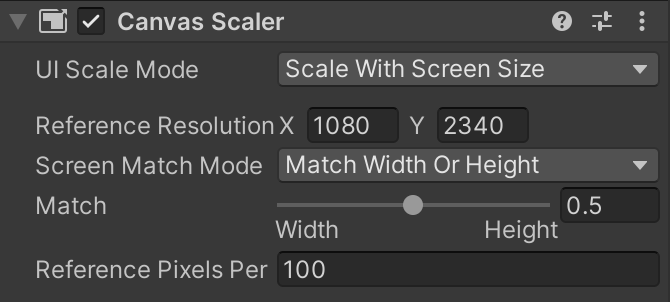

# Unity Frontend Structure

== All the frontend work are found under **ar-unity-project/Assets** ==

Items in *Assets/Scenes/* and *Assets/Prefab/* are to be viewed and edited in Unity. Item in *Assets/Scripts* are to be viewed and edited sin a coding IDE (VS Code). 

## Scenes
This folder holds all the UI [scenes](https://docs.unity3d.com/Manual/CreatingScenes.html). Each scene is a UI page, and the scene transitions are handled by scripts. 

The naming of the existing scenes should be intuitive enough, except for the main scene is named 'ARScene'. Only the ARScene has AR Session.


Double click on one of the scene to start editing. It's easier to use the 'Simulator' view instead of the scene view. You can start simulation on any scene, but with the current UI flow design you may get some errors if you don't start the simulation from the LoginScene.

### Creating Scene
When creating a scene, you must create a [Canvas](https://docs.unity3d.com/Packages/com.unity.ugui@1.0/manual/class-Canvas.html) to hold all the UI components and an [EventSystem](https://docs.unity3d.com/Packages/com.unity.ugui@1.0/manual/EventSystem.html) to track the user actions such as 'onClick' and 'onHover'. 


Note that the canvas for each scene has a Canvas Scaler component attached, which resizes the canvas for different sized devices automatically (although the auto-scaler can be crappy for some device models).



Before making a build, you need to add the new scene to the build settings:

1. File > Build Settings
2. Drag a drop the scene to *Scene In Build*.

### Styling Scene

Right-click on the scene hierachy view to add a gameobject (UI component) to Canvas, then in the **Inspector** tab, add components such as layout, image, animation, and custom script to the newly created gameobject to style the view.

Note: 

1. Avoid using 'auto-size' for the text fields as we won't be able to change the text size freely to a custom size at runtime.
2. When adding an Image component to the gameobject, you have to use 'sprites' as source image. Sprites (2D graphic objects) can be easily created in 2D Unity project but not in 3D Unity project, so if you want to use .jpg or .png as source image, use the Raw Image component instead.
3. Use Layout Group as much as possible to avoid hardcoding the component scale and position.

## Prefab
This folder holds all the pre-fabricated UI components ([prefabs](https://docs.unity3d.com/Manual/Prefabs.html)) , organized by the name of the scene for which the prefabs are created. For example, *CommentItem* is a prefab for the *CommentHistoryScene*, intended to be instantiated at runtime by *CommentHistoryUIController.cs* upon needs. 

It's difficult to create complex UI components through scripts at runtime, so we create a component template with Unity UI and make it a prefab by dragging the component to the prefab folder in the project panel in Unity. When needed, we instantiate the prefab and update fields of the component through script at runtime.

```
// instantiate gameobject from prefab
GameObject dialogObject = GameObject.Instantiate( DialogPrefab );

// update fields with real data
...
```

## Scripts
This folder holds all the C# scripts that controls the behavior of the scenes/gameobjects at runtime. The framework is Unity + .Net.

The scripts are currently organized by the MVC (Model/View/Controller) pattern.

### Model
The data models for object-oriented design. For example, *Message.cs* defines the object class *Message* which represents the parent data structure for the AR posts and comments.

- Location: user-owned location.

- Message: AR posts and comments.

- Response: response from the API calls, contains response body and error code.

- Topic: classifies the messages.

** Note: the fieldnames (member variable names) of the models must match the backend fieldnames (more precisely, the json fieldnames used to pass the data) so we can serialize/deserialize the json data directly with JsonConvert:

```
// deserialize json data to object(s)
List<Topic> topics = JsonConvert.DeserializeObject<List<Topic>>(data);

// serialize object(s) to json 
string json = JsonConvert.SerializeObject(topics, Formatting.Indented);
```

### View
The UI controller classes control the button action and object rendering in each scene. For example, *LoginUIController.cs* controls the UI (text input, login button click, etc.) for the *LoginScene*.

The UI controller classes inherit from Unity's [*MonoBehaviour*](https://docs.unity3d.com/ScriptReference/MonoBehaviour.html) class:

- `Awake()`: called only once at the initialization of the object, typically for creating component references (e.g. `GameObject btn = GameObject.Find("button");`) and initializing variables.

- `Start()`: called only once after Awake and before any Update; action in Start can be delayed (i.e. yield return after 1s or call coroutine).

- `Update()`: called once per frame, Unity default is 30 FPS.

If the scripted behavior is not working in the simulator (e.g. button click not working), check if the component reference is properly created in script. If you make the component reference variable public in your UI controller class, you can drag and drop the reference in Unity's inspector panel; however, the object reference can randomly get lost by drag-n-drop, so it's preferred to establish the reference in script.

The naming of these scripts might be a little confusing with the Controller/ folder.

### Controller
The manager classes are initialized as singleton objects (created once and not destroyed on scene changes) and are responsible for more general tasks such as making API calls.

- APIManager: manages the communication (get/post) with the backend APIs.

- ARContentManager: manages the fetching and rendering of the AR posts and comments in the ARScene.

- FirebaseManager: authenticates user with Firebase

- InputManager: manages the user inputs (e.g.publish AR post/comments).

- TopicManager: manages the topics-related backend API calls.

- UIManager: manages scene transitions, general UI control (e.g. font size, user preference) and UI constants.

- UserManager: manages the users-related backend & Firebase API calls.


### Other
There are a couple other tool scripts in the Scripts/ folder that are not classified by MVC:

- ConvertBase64ToBytes.cs: helper to convert base64 encoded image to bytes during deserialization of Message (specifically AR posts) objects.

- Dialog.cs: controls the initialization of a pop-up dialog/alert box. 

- LocationService.cs: attempt to use Unity's native location service as backup of Google's geospatial API to get user's device location coordinates.

- Mover.cs: script to move the flying comments in the ARScene.

- Utils.cs: all sorts of helper functions.

## Resources

This folder holds all the assets that you may want to load by script at runtime. 

For example, the following code loads the image *Resources/anonUserIcon.png* into a Texture2D object at runtime.

```
Texture2D userAvatarTexture = Resources.Load<Texture2D>("anonUserIcon");
```

**Resources/Screenshots** stores the screenshots of AR posts taken upon publication, which is meant to be used as the content preview for list display purpose.