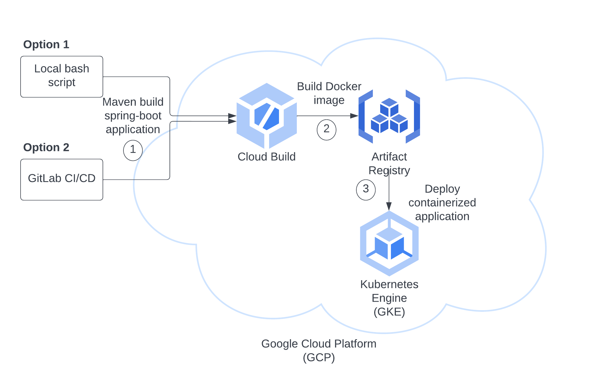

# Cloud Server Deployment

This document describes the cloud deployment strategy for the backend Java Spring-boot application.

## Tools
- Docker
- Kubernetes
- Google Cloud Kubernetes Engine
- Google Cloud Build
- Google Cloud Artifact Registry

## Pre-requisites
- Access to Google Cloud project **nearme-356517**. Ask Alice for access.

## Deployment methods



### Option 1: Local script deployment
#### First time setup
1. Install [Docker](https://docs.docker.com/get-docker/)
2. Install Kubernetes CLI [kubectl](https://kubernetes.io/docs/tasks/tools/)
3. Install Google Cloud CLI [gcloud](https://cloud.google.com/sdk/docs/install)
4. Run `gcloud init` and when prompted for project ID, enter **nearme-356517**.
5. Ensure maven 3.8 and java 18 are installed.

#### Running the deployment script
1. Ensure Docker desktop is running.
2. `cd ./NearMe/nearme-backend`
3. Locate the script **deployServer.sh**.
4. Go to [GKE console](https://console.cloud.google.com/kubernetes/list/overview?project=nearme-356517) and check if a cluster named **nearme-server-cluster** is active. If not, uncomment lines 57-58 in **deployServer.sh** to create the cluster.
5. Run the script to deploy a containerized server to GKE:
    ```
    ./deployServer.sh
    ```
    Note: If you get error running the script, check if it's a permission issue `chmod u+x`.
6. You should see some warnings but no error  in the terminal. Script will terminate in less than 10 minutes.
7. After the script finishes, wait another couple minutes for the pod to be scheduled. Proceed to next section to verify the deployment status.

### Option 2: GitLab CI/CD deployment

#### GitLab runner
GitLab CI/CD assigns 'jobs' to active GitLab runners. You may choose to install a GitLab runner on your local or ask Alice to start her runner when you need to run a pipeline.

1. Install [GitLab runner](https://docs.gitlab.com/runner/install/).
2. [Register](https://docs.gitlab.com/runner/register/) the runner.
3. Start the runner:
    ```
    sudo gitlab-runner run
    ```

#### Starting a deployment pipeline
1. Locate **.gitlab-ci.yml.bak** in the repo root, remove '.bak' from the end of the filename.
2. Go to [GKE console](https://console.cloud.google.com/kubernetes/list/overview?project=nearme-356517) and make sure a cluster named **nearme-server-cluster** is active. If not, create one with the same name and select auto-pilot mode.
3. Ensure at least one GitLab runner is running.
4. Make a new commit and push. You should see a pipeline is started on your branch in GitLab CI/CD.

## How to connect

1. Go to [GKE console](https://console.cloud.google.com/kubernetes/list/overview?project=nearme-356517), verify **nearme-server** is running under *Workloads* and **neame-server-service** is up under *Service & Ingress*.
2. In your terminal, run the following to obtain the exteral IP of the node:
    ```
    kubectl get nodes --output wide
    ```
3. Try to reach a server endpoint through Postman or command line:
    ```
    curl --request GET http://<External IP>:30876/healthCheck
    ```
    Note: This node port 30876 is exposed by nearme-server-service, specified in *deployment.yml*.

## Cleanup

When the cloud resource is no longer needed, delete the workload, service, and
cluster from the Google Cloud Kubernetes Engine console.

When a source archive is no longer needed, delete it from the Google Cloud Cloud
Storage console.

When an image is no longer needed, delete it from the Google Cloud Artifact
Registry console.

If CI/CD was used, before merging your branch onto master, revert the name of **.gitlab-ci.yml** to **.gitlab-ci.yml.bak**.