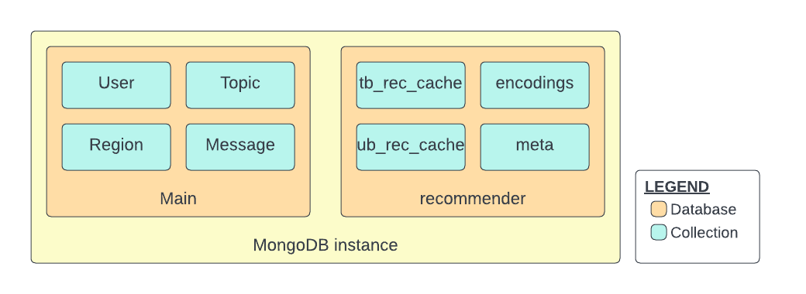

# Recommender DB Structure
This document records the structure of the database used by the topic recommender.

Topic recommender uses MongoDB as its cache database (i.e. a 'secondary database' in our main MongoDB instance):


## Recommender database
Database name = "recommender"

### Meta-data cache
Collection name = "meta"

Data:
```
{
    type: str,              // either "MESSAGE_COUNT" or "USER_COUNT"
    [region_id: str,]       // if type = "MESSAGE_COUNT"
    total: int,             // total user count if type="USER_COUNT"; total message count in region if type="MESSAGE_COUNT"
    timestamp: long         // UTC timestamp of the last update
}
```

### User-based recommender cache
Collection name = "ub_rec_cache"

Data:
```
{
    user_id: str,
    similar_users: [dict]           // list of similar users [{_id: str, Score: int, Subscriptions:[str]}]
}
```

### Topic-based recommender cache
Collection name = "tb_rec_cache"

Data:
```
{
    region_id: str,
    topic_id: str,
    similar_topics: {str: float}    // dict of {topic_id : similarity_score}
}
```

## Message encodings 
Collection name = "encodings"

Data:
```
{
    region_id: str,
    topic_id: str,
    encoded_messages: [[float]]     // list of encoded messages in this topic, one vector (list of floats) per message
}
```

